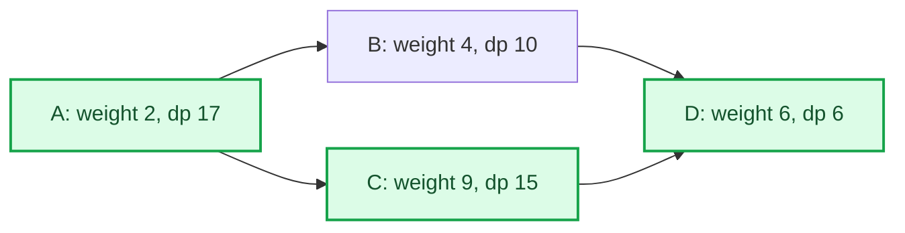

# Coin Collector

## Problem

- **Source:** [CSES 1686, Coin Collector](https://cses.fi/problemset/task/1686/)
- **Code:** [`View accepted C++ solution (coincollector.cpp)`](../coincollector.cpp)
- **Constraints:** 1 <= n <= 100000, 1 <= m <= 200000, and 1 <= x_i <= 10^9.

A directed graph assigns a nonnegative number of coins to every vertex. Starting anywhere, follow directed edges and maximize the total coins collected, counting each vertex's coins at most once.

Cycles prevent direct longest-path dynamic programming on the original graph: a topological order does not exist, yet traversing a cycle repeatedly yields no new coins.

## Idea

Inside a strongly connected component, every vertex can reach every other. Once a route enters such a component, it can visit all of its vertices, collect all their coins, and still leave through any desired outgoing edge: travel from the entry to all vertices, then to the tail of that exit. Because coins are nonnegative, omitting an accessible vertex never improves the result.

Therefore an SCC acts as one supervertex whose value is the sum of its vertices' coins. Contracting all SCCs produces the condensation graph. It is a DAG, since a directed cycle among distinct components would make them mutually reachable and hence one SCC.

The following condensation example shows the actual DP state, not merely the preprocessing order. Each component label gives its own coin sum and the optimal total obtainable from that component onward.

Here `dp[A] = 2 + max(10,15) = 17`. The highlighted route is $A\to C\to D$; choosing the smaller immediate value at $B$ would lose five coins overall.

The original problem is now maximum-weight path on a DAG. Define

$$
dp[C]=\text{maximum coins collectible by a path starting in component }C.
$$

Then

$$
dp[C]=\operatorname{val}[C]+\max(0,\max_{C\to D}dp[D]).
$$

Kosaraju's second pass assigns component labels in source-to-sink topological order for this implementation: label 1 is a source, and every condensation edge goes from a smaller label to a larger label. Processing labels from $k$ down to 1 therefore evaluates every successor before its predecessor.

Duplicate condensation edges are harmless. They may repeat the same candidate in a maximum but cannot change its value.

## Algorithm

1. Run iterative Kosaraju:
   - obtain finishing order on the original graph;
   - scan it backward on the reversed graph to label SCCs.
2. Sum the coin values of all original vertices into `val[component]`.
3. For every original edge $u\to v$ whose endpoints have different component labels, add condensation edge `comp[u] -> comp[v]`.
4. Process component labels from $k$ down to 1. Set `dp[c]` to `val[c]` plus the largest `dp` among its outgoing neighbors, or zero if it has none.
5. Print the largest `dp[c]` over all starting components.

## Correctness

### Lemma 1

For any route that enters an SCC $C$ and later leaves through an edge from $C$, there exists a route with the same entry and exit that collects every coin in $C$.

#### Proof

Strong connectivity gives a directed path between every ordered pair of vertices in $C$. Starting at the entry, visit any not-yet-collected vertex by such a path, repeating until every vertex has been visited. Then follow a path to the tail of the chosen exit edge. Repeated vertices add no coins but are permitted. Thus all of `val[C]` can be collected without changing the chosen exit. $\square$

### Lemma 2

Paths through SCCs in the original graph correspond to paths in the condensation DAG with the same maximum collectible value.

#### Proof

Contracting a route replaces every maximal interval spent inside one SCC by that component, producing a condensation walk. The condensation has no directed cycles, so this walk is a path. By Lemma 1, each visited component contributes its full summed value.

Conversely, for every condensation edge there is an original edge realizing it. Strong connectivity lets a route traverse each component from its incoming endpoint, collect all coins, and reach the selected outgoing endpoint. Hence every condensation path can be realized with the sum of its component values. $\square$

### Lemma 3

After processing component $C$, `dp[C]` equals the maximum weight of a condensation path starting at $C$.

#### Proof

All outgoing neighbors have larger labels and have already been processed in the descending loop. Any path from $C$ either stops there, worth `val[C]`, or first takes an edge $C\to D$ and then follows an optimal path from $D$, worth `val[C] + dp[D]`. The recurrence takes the maximum over exactly these choices. Reverse-topological induction proves the claim. $\square$

### Theorem

The algorithm prints the maximum number of coins collectible in the original graph.

#### Proof

Lemma 3 makes the maximum `dp` the best weighted path in the condensation DAG from any start. Lemma 2 establishes equality between that value and the best realizable route in the original graph. Therefore the printed result is optimal and attainable. $\square$

## Implementation

The first DFS uses `(vertex, next-edge-index)` frames so that `order_` is true postorder without recursion. Component sums and `dp` use `long long`; the optimum can be on the order of $n$ times the maximum coin value.

The descending component loop relies on the exact labels produced by this Kosaraju pass. If SCCs were numbered by another algorithm or traversal direction, an explicit topological sort might be required.

## Complexity

Kosaraju, condensation construction, and DAG dynamic programming each take $O(n+m)$ time. The graph copies and all auxiliary arrays use $O(n+m)$ space.

## Worked Example

Suppose vertices $1$ and $2$ form an SCC with coin values 4 and 7, vertices $3$ and $4$ form another with values 5 and 2, and there is an edge from the first SCC to the second. Their component values are 11 and 7. The sink component gets `dp = 7`; the source gets `dp = 11 + 7 = 18`.

Even if the entry into the first SCC is vertex $1$ and the only exit leaves vertex $2$, strong connectivity permits collecting both 4 and 7 before taking that exit.
