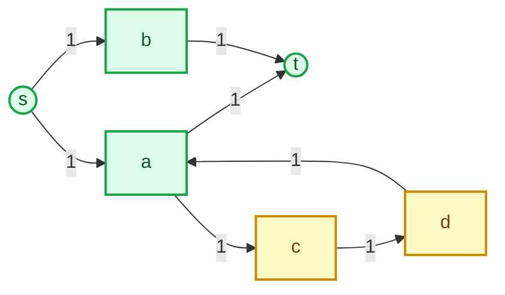

# Distinct Routes

## Problem

- **Source:** [CSES 1711, Distinct Routes](https://cses.fi/problemset/task/1711/)
- **Code:** [`View accepted C++ solution (distinctroutes.cpp)`](../distinctroutes.cpp)
- **Constraints:** 2 <= n <= 500 and 1 <= m <= 1000.

Find the maximum number of directed routes from vertex $1$ to vertex $n$ such that no input edge is used by two routes. Print both the maximum count and every route.

Vertices may be shared. Only edge reuse is forbidden.

## Idea

Give every directed input edge capacity one. Any collection of $k$ edge-disjoint routes sends one unit of flow along each route, producing a feasible flow of value $k$. Conversely, integral flow of value $k$ can be decomposed into $k$ source-to-sink paths plus possible directed cycles. Since all capacities are integers, Dinic's augmentations remain integral. Unit capacities make every used edge carry either zero or one.

Thus the maximum number of routes equals the maximum flow value. Dinic's algorithm computes it through level graphs and blocking flows.

The output still requires explicit routes. After max flow, a forward edge carries one unit exactly when its residual capacity is zero and its paired reverse capacity is one. Repeatedly find a path from source to sink using only such positive-flow edges, then consume its edges by restoring their forward residual capacities.

A maximum integral flow can contain a directed circulation in addition to source-to-sink flow. The cycle below carries flow but must not appear in any printed route.

The extracted routes are $s\to a\to t$ and $s\to b\to t$. The yellow circulation is left unused. This is why extraction searches for a complete sink-reaching path instead of greedily taking the first positive-flow edge forever.

Following an arbitrary positive-flow edge greedily is unsafe because an integral flow can contain a directed circulation. The implementation instead performs DFS and backtracks from branches that cannot reach the sink. Flow conservation guarantees that as long as unextracted source flow remains, some positive-flow path reaches the sink.

## Algorithm

1. Replace every input edge by a capacity-one forward residual edge and a capacity-zero reverse edge.
2. Run Dinic from vertex $1$ to vertex $n$:
   - BFS constructs residual levels;
   - DFS sends blocking flow along increasing-level edges.
3. Print the integer maximum-flow value.
4. Repeat once per unit of flow:
   - start DFS at vertex $1$;
   - traverse only original forward edges currently carrying one unit of flow;
   - tentatively consume an edge before recursing;
   - if the branch cannot reach $n$, restore the edge and backtrack;
   - retain the consumed edges once $n$ is reached.
5. Print every extracted vertex sequence.

## Correctness

### Lemma 1

The maximum flow value equals the maximum number of edge-disjoint routes.

#### Proof

Any $k$ edge-disjoint routes define a feasible value-$k$ flow by sending one unit along each route, so maximum flow is at least the optimum route count.

Dinic begins with integral capacities and augments by integral bottlenecks, so its final flow is integral. Any positive integral source-to-sink flow can be decomposed by repeatedly removing a positive-flow source-to-sink path; remaining directed cycles may be discarded. Unit capacities ensure no edge belongs to two removed paths. Therefore a flow of value $k$ yields $k$ edge-disjoint routes, so maximum flow is at most the optimum route count. The values are equal. $\square$

### Lemma 2

Before each extraction, if at least one unit of source flow remains, `extractPath` finds a positive-flow path from vertex $1$ to vertex $n$.

#### Proof

Let $R$ be the set reachable from vertex $1$ through positive-flow original edges. If $n\notin R$, no positive flow leaves $R$ by definition. Flow conservation at internal vertices implies that the net flow leaving any set containing the source but not the sink equals the remaining flow value, which is positive. This contradicts the absence of a positive-flow edge leaving $R$. Hence $n\in R$, and exhaustive DFS finds such a path. $\square$

### Lemma 3

Each extracted route is valid, and no input edge appears in two extracted routes.

#### Proof

DFS appends a vertex only by traversing an original directed input edge carrying one unit of flow. It reports success only upon reaching $n$, so the retained sequence is a valid route from $1$ to $n$. On success, every route edge is consumed by changing its residual pair to the unused-flow state. Later extraction searches therefore cannot select it. $\square$

### Theorem

The algorithm prints a maximum-size collection of edge-disjoint routes.

#### Proof

By Lemma 1, Dinic's flow value is the optimum number of routes. Lemma 2 shows that every iteration successfully extracts one route until that many routes have been produced. Lemma 3 proves they are valid and pairwise edge-disjoint. Hence the printed collection is feasible and optimal. $\square$

## Implementation

Residual edges are paired, so even identifiers are original forward arcs and `id ^ 1` is the reverse arc. For a unit edge, the condition `cap == 0` and reverse `cap == 1` identifies one unit of current flow.

`extractPath` consumes an edge before recursion. A failed branch restores both residual capacities; a successful branch leaves them restored to their original no-flow state, permanently removing that unit from the remaining decomposition.

The per-extraction `seen` array prevents positive-flow cycles from causing recursion loops. With at most 500 vertices, recursive extraction depth is safe.

## Complexity

Dinic on a unit-capacity network is within the general $O(n^2m)$ bound used here. Route extraction performs at most one DFS over $O(n+m)$ residual structure for each of $F$ routes, taking $O(F(n+m))$. Since $F\le m$, total time is bounded by $O(n^2m+Fm)$ up to vertex terms, and auxiliary space is $O(n+m)$ plus the printed routes.

## Worked Example

For edges $1\to2$, $2\to4$, $1\to3$, $3\to4$, and $2\to3$, max flow has value 2. One unit may use $1,2,4$ and another $1,3,4$.

The first extraction consumes edges $1\to2$ and $2\to4$. The second can no longer select either, but still finds $1\to3\to4$. If a positive-flow cycle were attached at vertex $2$, DFS could explore it, mark its vertices, backtrack, and still choose the branch to $4$.
