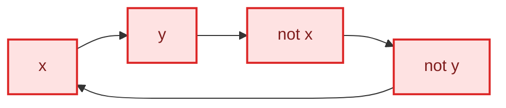

# Giant Pizza

## Problem

- **Source:** [CSES 1684, Giant Pizza](https://cses.fi/problemset/task/1684/)
- **Code:** [`View accepted C++ solution (giantpizza.cpp)`](../giantpizza.cpp)
- **Constraints:** 1 <= n,m <= 100000.

Choose whether each of $m$ pizza toppings is included. Each of $n$ customers supplies a clause containing two signed toppings, and at least one literal in every clause must be satisfied. Print one valid assignment or `IMPOSSIBLE`.

Every condition has two literals, so the instance is a 2-SAT formula.

## Idea

A clause $(a\lor b)$ fails only when both literals are false. Equivalently,

$$
\neg a\Rightarrow b
\qquad\text{and}\qquad
\neg b\Rightarrow a.
$$

Create one implication-graph vertex for each literal $x_i$ and $\neg x_i$. An edge $p\to q$ means every satisfying assignment that makes $p$ true must also make $q$ true.

If a literal and its negation belong to the same SCC, each implies the other. Setting either truth value forces its opposite, so no assignment exists. The converse is the central 2-SAT theorem: if no variable's two literals share an SCC, the condensation graph is a DAG and its reverse topological order supplies a consistent assignment.

The contradiction test is easier to see on an implication cycle. In the graph below, following implications from $x$ forces $\neg x$, while another directed path forces $x$ again from $\neg x$.

Every node shown lies in one SCC. In particular, both truth choices for $x$ imply their own negation, so no assignment can satisfy all clauses that produced these edges.

The encoding uses adjacent indices. `2*i` represents positive literal $x_i$, `2*i+1` represents negative literal $\neg x_i$, and XOR with 1 negates either literal.

This implementation's Kosaraju labels SCCs in source-to-sink topological order. It sets $x_i$ true when the positive literal's component has the larger label. Thus the literal chosen true is the one later in topological order, while its negation is false.

## Algorithm

1. Represent every signed topping as a literal vertex.
2. For each clause $(a\lor b)$, add implication edges $\neg a\to b$ and $\neg b\to a$ to the graph and the reversed graph.
3. Run iterative Kosaraju to label all SCCs.
4. For each topping $i$:
   - if `comp[2*i] == comp[2*i+1]`, print `IMPOSSIBLE`;
   - otherwise, choose `+` exactly when `comp[2*i] > comp[2*i+1]`.
5. Print the resulting signs.

## Correctness

### Lemma 1

An assignment satisfies a clause $(a\lor b)$ exactly when it respects both implication edges $\neg a\to b$ and $\neg b\to a$.

#### Proof

If the clause is false, both $a$ and $b$ are false, so $\neg a$ is true while $b$ is false and the first implication is violated; likewise for the second. If the clause is true, then whenever $\neg a$ is true, $a$ is false and therefore $b$ must be true; the first implication holds. The symmetric argument proves the second. $\square$

### Lemma 2

If a literal and its negation lie in the same SCC, the formula is unsatisfiable.

#### Proof

Mutual reachability means the literal implies its negation and its negation implies the literal. Any assignment must make one of them true. Following the corresponding implication path forces the other true as well, which is impossible because they are logical complements. $\square$

### Lemma 3

When no complementary literals share an SCC, the assignment selected by the component-label comparison respects every implication.

#### Proof

Suppose, for contradiction, that implication $p\to q$ has $p$ true and $q$ false. The implication graph construction also contains the contrapositive companion $\neg q\to\neg p$, because edges are added in pairs for clauses.

Component labels increase along every condensation edge. Since $p$ is chosen over $\neg p$, `comp[p] > comp[not p]`. Since $q$ is false, `comp[not q] > comp[q]`. The two implication edges give `comp[p] <= comp[q]` and `comp[not q] <= comp[not p]`, unless endpoints share a component, where equality still holds. Combining them yields

$$
\operatorname{comp}(p)
\le \operatorname{comp}(q)
< \operatorname{comp}(\neg q)
\le \operatorname{comp}(\neg p)
< \operatorname{comp}(p),
$$

a contradiction. Therefore every implication is respected. $\square$

### Theorem

The algorithm prints `IMPOSSIBLE` exactly for unsatisfiable instances; otherwise it prints a satisfying topping assignment.

#### Proof

If the algorithm rejects, Lemma 2 proves unsatisfiability. Otherwise, Lemma 3 shows that the constructed assignment respects all implication edges. Lemma 1 then shows that every original clause is satisfied. $\square$

## Implementation

`lit(x, true)` returns `2*x`, while `lit(x, false)` returns `2*x+1`. Because complementary indices differ only in their low bit, `literal ^ 1` computes negation.

The graph allocates indices through `2*(m+1)-1`; indices 0 and 1 are unused logical padding but do not affect SCC ordering or correctness.

The assignment comparison depends on this exact Kosaraju labelling direction. Reversing either pass requires reversing the comparison as well.

## Complexity

The implication graph has $2m$ relevant literal vertices and $2n$ edges. Kosaraju takes $O(m+n)$ time and the graph, reverse graph, stacks, and arrays use $O(m+n)$ space.

## Worked Example

Take clauses $(x_1\lor x_2)$, $(\neg x_1\lor x_2)$, and $(\neg x_2\lor x_1)$. They add implications such as $\neg x_1\to x_2$ and $x_2\to x_1$. The SCC condensation places the positive literals consistently later than their negatives, so the algorithm chooses both toppings. All three clauses are then true.

Adding $(\neg x_1\lor\neg x_1)$ would force $x_1\to\neg x_1$, while the existing implications can force the reverse. If both literals merge into one SCC, the algorithm correctly rejects the formula.
